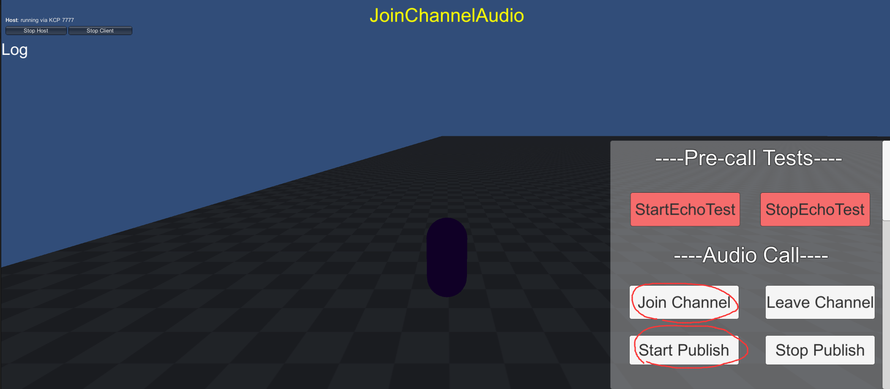

# 问题背景
我们的项目的需求之一是在Unity中使用声网（Agora）的SDK提供的回声消除（AEC）功能实现三维空间中的语音聊天室。其中，我们希望能够获得各个角色各自的声音，让对应的声音通过Unity自带的Audio Source播放出来。

# 实现过程

以下代码继承自官网中Unity SDK的Demo。

Assets\API-Example\Examples\Basic\SpatialJoinChannelAudio\SpatialJoinChannelAudio.cs

这个类扩展了加入音频频道的基础功能，实现了对声网SDK的初始化，设置音频帧参数，并关闭声网默认的扬声器播放功能，将PCM数据传递给Unity的AudioClip进行处理。它的基类是JoinChannelAudio，有略微修改，主要是让JoinChannel传参时会传送玩家的uid，还有把AEC的策略设为了aggressive。

Assets\API-Example\Examples\Basic\SpatialJoinChannelAudio\PlayerController.cs

这个类处理玩家的移动和音频数据。它使用Mirror同步不同玩家之间的位置关系和对应的uid。此外它还创建了一个AudioClip，并在接收到声网SDK传递的音频数据时更新这个AudioClip。

# 主要问题
为了在Unity中用自己的Audio Source播放音频，我们需要关闭声网SDK的默认外放功能。这是通过设置AdjustPlaybackSignalVolume(0)实现的（我们无法从文档里找到更多的关闭外放的方法了）。但这个方法导致混音后的音频数据也变成静音了，我们只能获取到混音前的音频数据，也就是没有经过AEC处理的原始音频数据。但我们的目标是获得经过AEC后的音频数据。

# 需求
我们需要一种方式，在关闭声网SDK默认外放的同时，仍然能够获取到经过AEC处理的音频数据。

# 如何复现我们的情况

两台在同一个局域网中的电脑打开Assets\API-Example\Examples\Basic\SpatialJoinChannelAudio中的场景，一台电脑单击左上角的Host(Server + Client)以建立主机，用ipconfig记录下主机的ip，另一台电脑在左上角的地址填写处填写刚才记录的主机ip并单击Client以连接主机。此时双方会出生在一个平面上。

按WS前进/后退，AD左转/右转。然后双方单击Join Channel和Start Publish以进入语音聊天。此时会出现啸叫和回声现象，即这里描述的问题。

如果appid和token过期，请在asset中的AppIdInput中填写对应信息。

期望的解决方案
我们希望声网工程师能提供一种方法或API，允许我们在关闭声网SDK的默认外放的同时，获取到经过AEC处理的音频数据。如果有其他方法可以关闭SDK的默认外放而不影响音频数据的获取，我们也非常期待了解。

以上是我们项目中遇到的主要问题和我们的需求。我们已经尽力在现有的框架和文档中寻找解决方案，但仍未能找到满意的答案。我们期待声网工程师的专业指导和支持，以帮助我们实现项目目标。